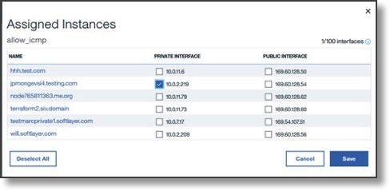

---

copyright:
  years: 2017, 2018
lastupdated: "2018-11-10"

keywords: assign, instance

subcollection: security-group

---

{:shortdesc: .shortdesc}
{:codeblock: .codeblock}
{:screen: .screen}
{:new_window: target="_blank"}
{:pre: .pre}
{:note: .note}
{:important: .important}
{:tip: .tip}
{:table: .aria-labeledby="caption"}

# Assigning Instances to the Security Group
{: #assigning-instances-to-the-security-group}

You can assign security group objects to instances in one of two ways:

## Using the Security Menu
{: #using-the-security-menu}

1. From the **Security** tab on the [Customer Portal ](https://control.softlayer.com/){: new_window}, under **Network Security** select **Security Groups**.
2. Click the  icon of the Security Group object you wish to assign instances to, then select **Manage Instances**.
3. Select the instance and interface to apply to the Security Group.

	

	In the figure, the "allow_icmp" Security Group (created in the [first step](/docs/infrastructure/security-groups?topic=security-groups-creating-a-security-group)) is applied to the private interface (`10.0.2.219`) of "jpmongevsi4".

	Note how the **Attached Instances** count increased from `0` to `1`.

4. Click **Save** to apply the changes.

5. Reboot your instance.

	This is a one-time-only step per network interface for instances not created with a security group.
  {: note}

## Using the Devices Menu
{: #using-the-devices-menu}

1. From the **Devices** tab on the [Customer Portal ](https://control.softlayer.com/){: new_window}, select **Device List**.
2. Click the instance name where you want to apply the Security Group object.
3. Select **Modify** and mark the Security Group object you want to associate with the instance.

	

	This figure shows the "allow_icmp" Security Group object being assigned to the private interface of jpmongevsi4 instance.
4. Click **Save** to apply the changes.

5. Reboot the instance.

	This is a one-time-only step per network interface for instances not created with a security group.
  {: note}

## Next step...
{: #next-step-1}

[Edit the Security Group](/docs/infrastructure/security-groups?topic=security-groups-editing-a-security-group) to modify its parameters.  
