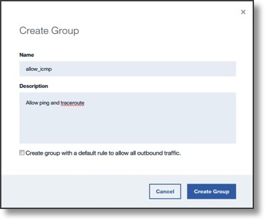

---

copyright:
  years: 2017
lastupdated: "2019-11-14"

keywords: create, configure, configuration, custom

subcollection: security-groups

---

{:shortdesc: .shortdesc}
{:codeblock: .codeblock}
{:screen: .screen}
{:new_window: target="_blank_"}
{:pre: .pre}
{:note: .note}
{:important: .important}
{:tip: .tip}
{:table: .aria-labeledby="caption"}
{:external: target="_blank_" .external}

# Creating a security group
{: #creating-a-security-group}

You can create and configure a custom IBM™ Cloud Security Group using the instructions here.
{: shortdesc}

1. From your browser, open the [IBM Cloud console](https://cloud.ibm.com/) and log into your account.
2. From the Dashboard, click the Menu icon  > **Classic Infrastructure** to get to the Classic Infrastructure landing page.
3. From the Classic Infrastructure menu, select **Security** >  **Network Security** > **Security Groups** to get to the Security Groups page.
4. On the Security Groups page, click on the **Create Group +** button.
5. Enter a name for the Security Group and optionally a description.
6. Click **Create Group**.

   

Note that the **Create group with a default…** checkbox is unmarked. This means no outbound rule will be created for this Security Group object. As a result, unless other outbound rules or Security Group objects are created, only incoming requests (such as SSH and ICMP) and their related (outgoing) traffic flows or responses will be permitted.

## Next step...
{: #next-step-2}

[Create a rule](/docs/security-groups?topic=security-groups-creating-a-new-rule) to allow incoming requests (SSH & ICMP) and their related (outgoing) traffic flows.  
