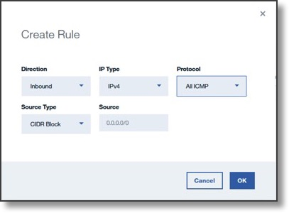

---

copyright:
  years: 2017
lastupdated: "2019-11-14"

keywords: create, new, rule, ssh, icmp

subcollection: security-group

---

{:shortdesc: .shortdesc}
{:codeblock: .codeblock}
{:screen: .screen}
{:new_window: target="_blank_"}
{:pre: .pre}
{:table: .aria-labeledby="caption"}
{:note: .note}
{:important: .important}
{:tip: .tip}
{:external: target="_blank_" .external}

# Creating a New Rule
{: #creating-a-new-rule}

You can allow incoming requests (SSH & ICMP) and their related (outgoing) traffic flows for your IBM™ Cloud Security Groups by performing the instructions here.
{: shortdesc}

1. From the [IBM Cloud console](https://cloud.ibm.com/) dashboard, click the Menu icon  > **Classic Infrastructure** to get to the Classic Infrastructure landing page.
2. From the Classic Infrastructure menu, select **Security** >  **Network Security** > **Security Groups** to get to the Security Groups page.
3. On the Security Groups page, select the Security Group object to which you want to add a rule.
4. On the Rules tab, click the **Create Rule +** button.
5. Specify the rule's Direction, IP Type, Protocol, Port Range, Type, Code and Source when applicable (based on the Protocol selection).

	Unless you are using another Security Group as the source, leave **Source Type** as "CIDR Block".

	

	The figure shows **All ICMP** selected as the protocol, which means all ICMP Types and Codes will be allowed. Additionally, the Source field is being left empty, using the default value of `0.0.0.0/0` -- the equivalent to any IP address or subnet.

6. Click **OK** to finish.

## Next step...
{: #next-step-3}

[Assign instances to the Security Group](/docs/security-groups?topic=security-groups-assigning-instances-to-the-security-group) using either the Security Menu or the Device Menu.
