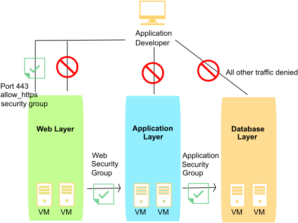

---

copyright:
  years: 2017
lastupdated: "2017-08-08"

---

{:shortdesc: .shortdesc}
{:new_window: target="_blank"}

# About security groups (Beta)

## What is a security group?
A *security group* is a set of IP filter rules that define how to handle incoming (ingress) and 
outgoing (egress) traffic to both the public and private interfaces of a virtual server instance. The 
rules that you add to a security group are known as *security group rules*.
{:shortdesc}

* You can assign security groups to a single virtual server or multiple virtual server 
  instances.
* You can assign security groups that are provided by IBM or that you create.
* The inbound traffic to a virtual server instance is referred to as ingress traffic.
* The outbound traffic from a virtual server instance is referred to as egress traffic.

## Security groups provided by IBM
You can assign any of the following security groups that are provided by IBM® to the network 
interfaces of your virtual server instances:

* *allow_ssh*: This security group defines the IP rules that allow ingress TCP traffic on the SSH port only (22/TCP).  All other traffic is blocked.
* *allow_http*: This security group defines the IP rules that allow ingress traffic on HTTP port only (80/TCP).  All other traffic is blocked.
* *allow_https*: This security group defines the IP rules that allow ingress TCP traffic on HTTPS port only (443/TCP).  All other traffic is blocked.
* *allow_outbound*: This security group defines the IP rules that allow all egress traffic from the server.
* *allow_all*: This security group defines the IP rules that allow all ingress traffic on all ports.

**Note:** Each predefined security group contains one security group rule. 

In the following diagram, virtual server instances are 
associated with a set of security groups to restrict network traffic. The arrows represent network traffic flow. The application developer has restricted access to the various infrastructure layers, as follows:

* The application developer can access only the web layer on TCP port 443 (https).
* Only web layer instances can access the application layer instances.
* Only the application layer instances can access the database layer instances. 

